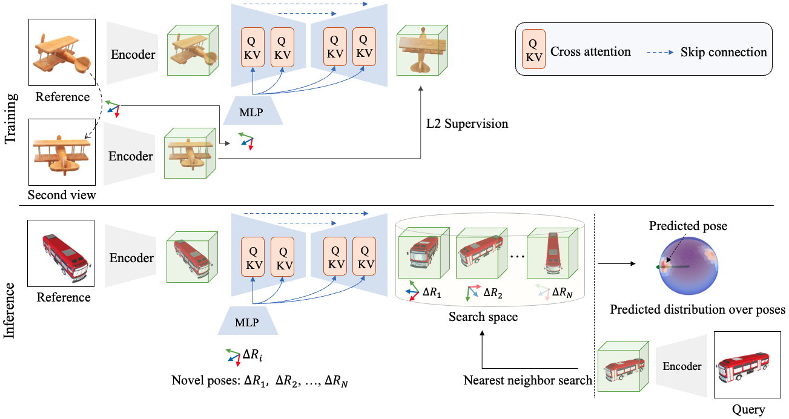

## NOPE: Novel Object Pose Estimation from a Single Image <br><sub>Official PyTorch implementation </sub>



**NOPE: Novel Object Pose Estimation from a Single Image**<br>
[Van Nguyen Nguyen](https://nv-nguyen.github.io/)
, [Thibault Groueix](http://imagine.enpc.fr/~groueixt/)
, [Yinlin Hu](https://yinlinhu.github.io/),
[Mathieu Salzmann](https://people.epfl.ch/mathieu.salzmann), 
[Vincent Lepetit](https://vincentlepetit.github.io/) <br>
**[Paper](https://arxiv.org/pdf/2303.13612.pdf)
, [Project Page](https://nv-nguyen.github.io/nope/)**

Abstract: *The practicality of 3D object pose estimation remains limited for many applications due to the need for prior knowledge of a 3D model and a training period for new objects. To address this limitation, we propose an approach that takes a single image of a new object as input and predicts the relative pose of this object in new images without prior knowledge of the object’s 3D model and without requiring training time for new objects and categories. We achieve this by training a model to directly predict discriminative embeddings for viewpoints surrounding the object. This prediction is done using a simple U-Net architecture with attention and conditioned on the desired pose, which yields extremely fast inference. We compare our approach to state-of-the-art methods and show it outperforms them both in terms of accuracy and robustness.*


<p align="center">
  
</p>


You can also put a star :star:, if the code is useful to you.

If you like this project, check out related works from our group:
- [Templates for 3D Object Pose Estimation Revisited: Generalization to New objects and Robustness to Occlusions (CVPR 2022)](https://github.com/nv-nguyen/template-pose) 
- [PIZZA: A Powerful Image-only Zero-Shot Zero-CAD Approach to 6DoF Tracking
(3DV 2022)](https://github.com/nv-nguyen/pizza)
- [BOP visualization toolkit](https://github.com/nv-nguyen/bop_viz_kit)

## Citation

```latex
@article{nguyen2023nope,
title={NOPE: Novel Object Pose Estimation from a Single Image},
author={Nguyen, Van Nguyen and Groueix, Thibault and Hu, Yinlin and Salzmann, Mathieu and Lepetit, Vincent},
journal={arXiv preprint arXiv:2303.13612},
year={2023}}
```

This repository is running with the Weight and Bias logger. Ensure that you update this [user's configuration](https://github.com/nv-nguyen/nope_released/blob/main/configs/user/default.yaml) before conducting any experiments. 
## Installation :construction_worker:

<details><summary>Click to expand</summary>

### 1. Create conda environment
```
conda env create -f environment.yml
conda activate nope
```

### 2. Datasets
Please note that the total dataset size is huge (~2TB). Before running the following commands, ensure that you have sufficient memory to handle this volume of data.
#### Option 1: Render dataset from scratch:
```
python -m src.scripts.generate_data --step select_cad --cad_dir $YOUR_CAD_DIR --save_dir $YOUR_SAVE_DIR
python -m src.scripts.generate_data --step generate_poses_and_images --cad_dir $YOUR_CAD_DIR --save_dir $YOUR_SAVE_DIR
```
#### Option 2: Contact the first authors to get the pre-rendered dataset
Rendering the dataset from scratch may take several days or even a week, depending on your compute power. To facilitate easy reproducibility and experimentation with this repository, you can contact the first author to manage transferring the dataset (over SSH for example).

</details>


## TODO
- Gradio demo on real images of unseen objects of TLESS, unseen categories of ShapeNet
- Refactoring src/dataloader, src/model and Reproduce and sharing wandb logger of training